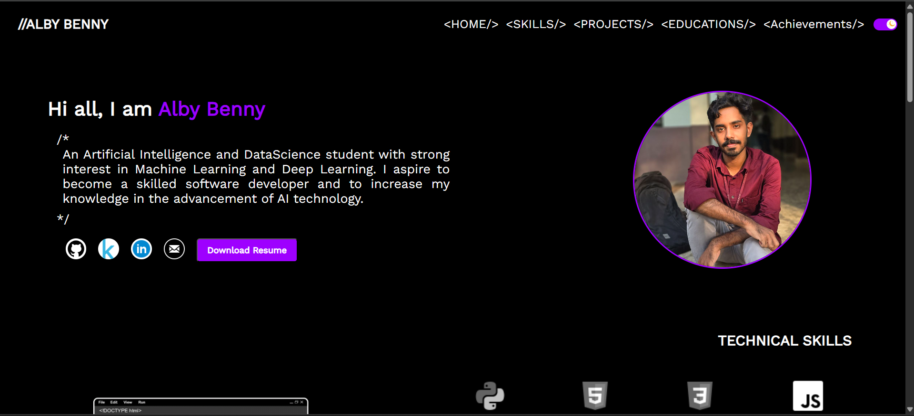
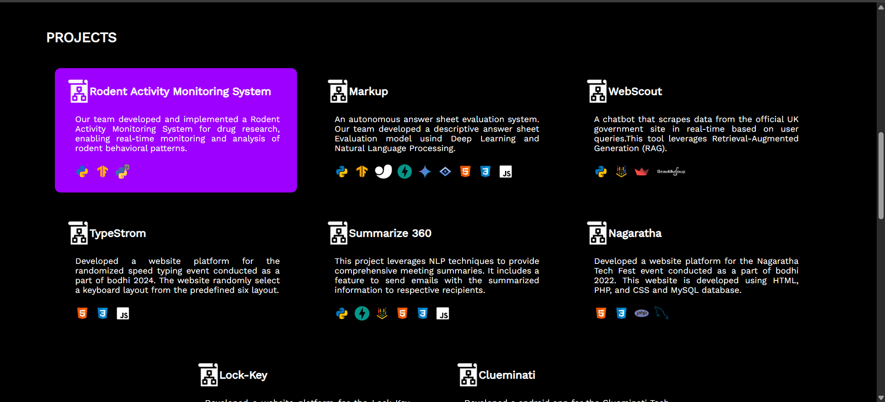
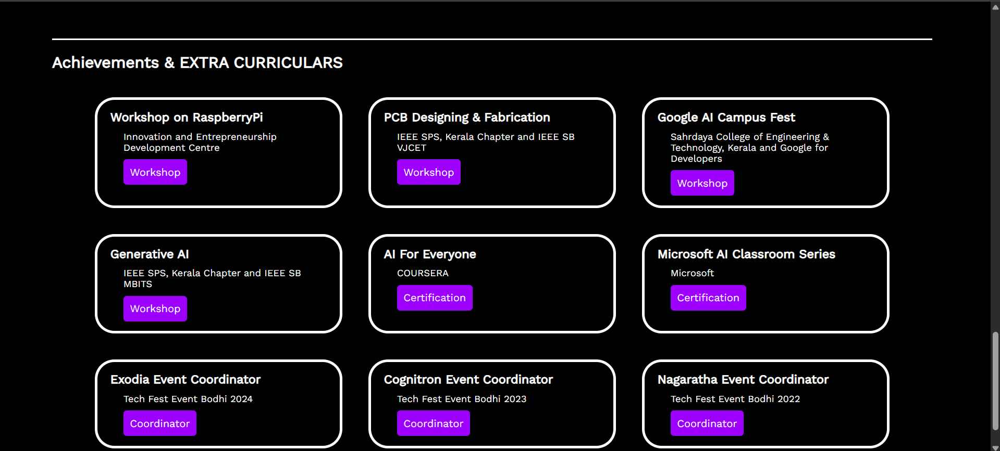

# Portfolio Website

Welcome to my portfolio website! This is a personal project to showcase my work, skills, and projects in software development and artificial intelligence.

## Features
- **Responsive Design:** The website is fully responsive and adapts to different screen sizes.
- **Static Web Page:** Hosted as a static web page for fast loading and easy maintenance.
- **Projects Showcase:** Highlights various projects I have worked on, including AI models, web applications, and automation tools.
- **Contact Information:** Provides ways to reach out via email and social media links.
- **Dynamic Elements:** Uses animations and interactive components for an engaging user experience.

## Screenshots
Here are some previews of the portfolio website:

## Technologies Used
- **Frontend:** HTML, CSS, JavaScript
- **Hosting:** Deployed on a Render hosting platform

## Future Improvements
- Add seperate page for viewing Projects
- Add a chatbot using **Llama 3.2 (Ollama) with Node.js**.
- Improve project filtering and search functionality.

## Contact
If you have any questions or would like to collaborate, feel free to reach out!

---
Thank you for visiting my portfolio!

